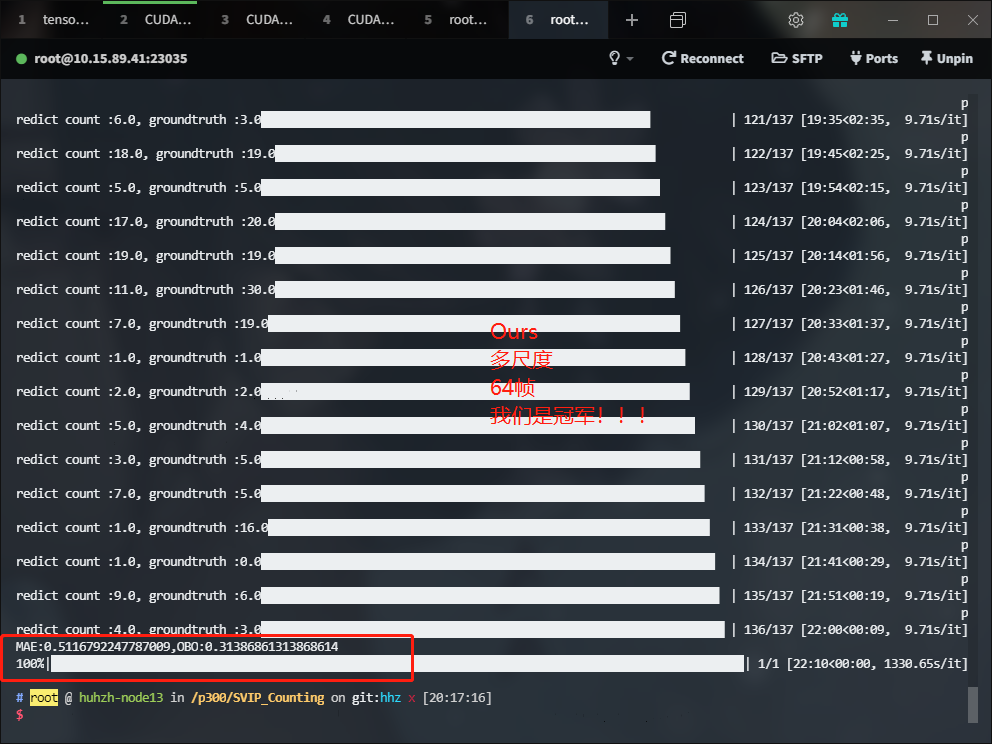
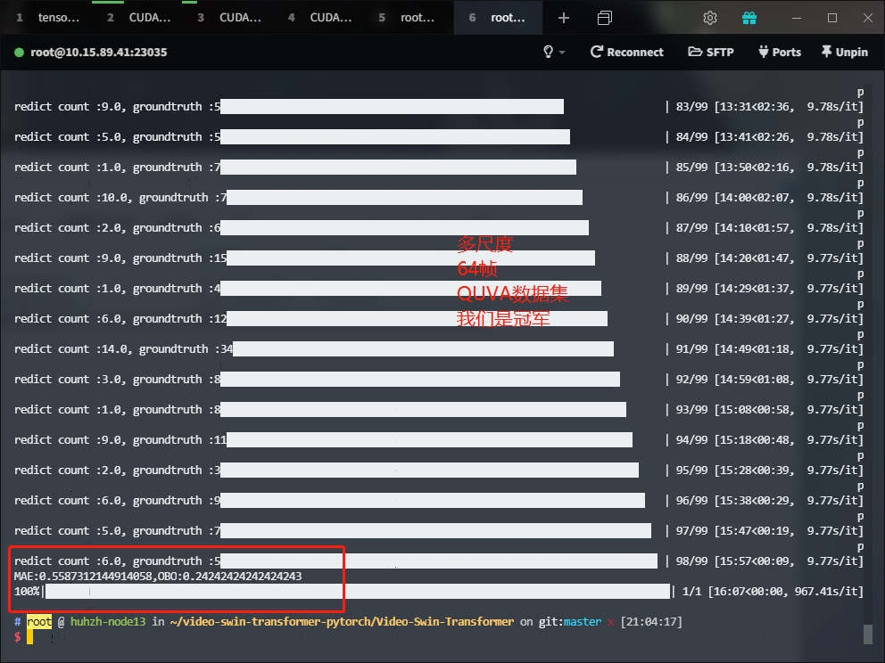

# 1112

### Experiment  1
repnet复现  
### hyperparameter
视频长度抽取64帧，64x112x112  
epoch 100  
learning rate 1e-5
loss=lossCE(y1,y1^)+5*lossBCE(y2,y2^)
batchsize=8    
### main work
repnet复现    
特征提取resnet50-4.3
### result
tensorboard /p300/logs/scalar1112_3  
tensorboard /p300/logs/scalar1110_3   是错误网络结构得到的结果

### Experiment  2
**单尺度**实验  
### hyperparameter
视频长度抽取64帧，64x224x224  
scale [1]  改为单尺度
epoch 100 
similarity matrix heads=4  
learning rate 1e-5      
loss=loss1
batchsize=8  
### main work
单尺度  
增加权重初始化  
特征提取部分(video-swin-transformer)全部冻结，只学习后面的部分
tensorboard /p300/logs/scalar1112_2
lastckpt = '/p300/checkpoint/1112_2_99.pt'这个效果比较好
MAE=0.875  OBO=0.145

### Experiment  2
**多尺度**实验
### hyperparameter
视频长度抽取64帧，64x224x224  
scale [1,4,8]  
epoch 100
similarity matrix heads=4  
learning rate 8e-6
loss=loss1
batchsize=4
### main work
多尺度融合，Replication_padding  
增加权重初始化  
特征提取部分(video-swin-transformer)全部冻结，只学习后面的部分
### result
tensorboard /p300/logs/scalar1112_1  
这个需要保留  
ckpt /p300/checkpoint/1112_1_99.pt  

我们赢了，我们是冠军  
MAE=0.51  OBO=0.31
多尺度在QUVA数据集上    
MAE=0.558   OBO=0.242
