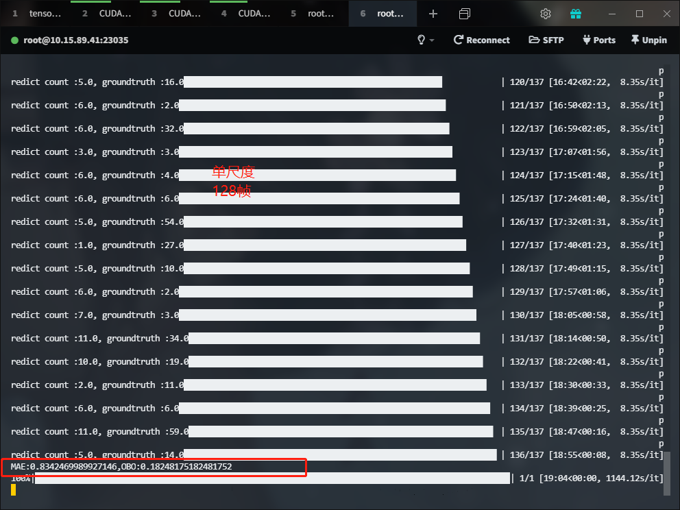

### Experiment  1
**单尺度**
### hyperparameter
视频长度抽取**128**帧，128x224x224  
scale [1]  改为单尺度
epoch 100 
similarity matrix heads=4  
learning rate 1e-5      
loss=loss1
batchsize=8  
### main work  
单尺度对照    
增加权重初始化      
特征提取部分(video-swin-transformer)全部冻结，只学习后面的部分    
tensorboard /p300/logs/scalar1113_128    
lastckpt = '/p300/checkpoint/1113_128_99.pt'这个效果比较好    
MAE=0.835  OBO=0.182    
  